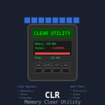

# My basic clear routine for the HP-41 calculator

 
 
I assign this function ("CLR") to CLX and use this to clear the calculator.
 
It sets the flags to the RCLFLAG that is taken from the HEPAX file "C". To
initiate this file with the flags you have set, run "NEWC" first. If you later
change your flag setup (different FIX setting, DMY, etc), simply run NEWC
again to update the HEPAX file "C" to your new settings.

After clearing the stack and Alpha and resetting the calculator to the flag
settings stored in the HEPAX file "C", the program stops.

Upon pressing R/S, the program commences to show the current week number
and the illuminated fraction of the Moon's disk (with a "+" appended if the
Moon phase is growing or a "-" if the phase is shrinking).

Pressing R/S again yields the current Julian Day number.

Press R/S once more and the program displays the running clock.

Press R/S twice to clear the display, stack and Alpha and leave the calculator
in the program "CLR*" which marks the endpoint of the clear routine.
